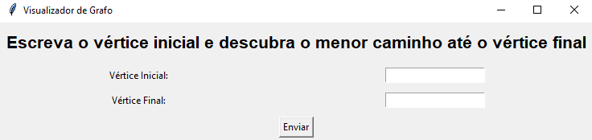
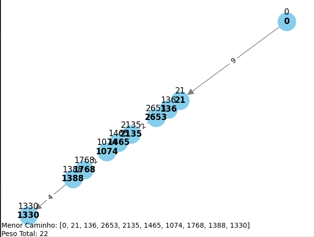

<h1 align='center'>🔷Facebook Network🔷</h1>
Este projeto foi realizado como parte da cadeira de Algoritmos. Nele, os grupos selecionavam uma base de dados disponível na internet relacionada a algum tipo de conexão que pudesse ser representada por um grafo. A partir dessa base de dados, construíamos um grafo com vértices e arestas, atribuindo pesos às conexões quando não estavam explicitamente fornecidos. Com o grafo pronto, nosso objetivo era aplicar o algoritmo de Dijkstra para encontrar o caminho mais curto entre um vértice inicial e um vértice final.


## Interface




## Instruções

```

```


